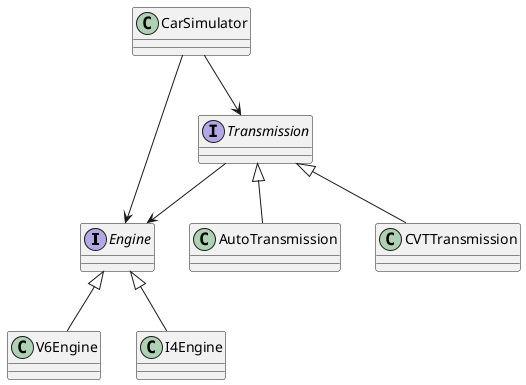

Now you have Dag_factory setup, let's explore some of its commonly used features.

## Interface Injection

Imaging we are developing an automotive simulation tool that contains following components:
<!-- tabs:start -->

### **Diagram**


### **Source**

[snippet](snippets/car_sim.cpp ':include :type=code :fragment=car_sim_oop')

<!-- tabs:end -->

The following snippet creates a Blueprint that selects `I4Engine` and `CVTTransmission` for simulation:

[snippet](snippets/car_sim.cpp ':include :type=code :fragment=car_sim_oop_blueprint')

> Note: Factory methods like `i4Engine()` are tagged with the `dag_shared` modifier. Dag_factory ensures that only a single instance of their returned value exists in the graph, and all other components in the same graph will reference this instance. Essentially, you can consider their returned values as per-graph singletons.

Blueprints contain a set of factory methods. For each class—whether abstract or concrete—there is a corresponding factory method in the blueprint with the same name but with the first character in lowercase.

For concrete classes, these factory methods call `make_node<>` or similar helpers to create and return an instance. For abstract classes, their factory methods call the factory methods of a concrete class. This defines the mapping from interfaces to implementations in Dag_factory.

Blueprints can be passed to a `DagFactory` to create and return the object graph:

[snippet](snippets/car_sim.cpp ':include :type=code :fragment=car_sim_oop_blueprint_test')

The `DagFactory::create()` function accepts an initializer—a callable object that takes a single parameter, a pointer to the Blueprint instance. This initializer is the only point where user logic interacts with the Blueprint. It selects a node from the created graph, wraps it in a `dag::unique_ptr`, and returns it. This allows user logic to interact with the selected node and control the lifespan of the graph. When the `dag::unique_ptr` goes out of scope or is reset, the entire graph is destroyed.

Here is the output of the above code:

```
===========Running OOP simulation==========
CarSimulator started
===========Ending OOP simulation==========
CarSimulator destroyed
CVT Transmission destroyed
I4 Engine destroyed
```

## Change the Interface Mapping

The interface-to-implementation mapping can be changed by overriding the methods in the blueprint.

Here is how `V6Engine` and `AutoTransmission` can be selected in a derived Blueprint:

[snippet](snippets/car_sim.cpp ':include :type=code :fragment=car_sim_oop_powerful_blueprint')

And here is the output after the new Blueprint is passed to the `DagFactory`:

```
===========Running OOP simulation==========
CarSimulator started
===========Ending OOP simulation==========
CarSimulator destroyed
Auto Transmission destroyed
V6 Engine destroyed
```

## Intercept Object Creation
DagFactory supports two type of extensions, Creater and Intercepter. Creater is called by DagFactory when it wants to create an object instance and Intercepter is called after an instance has been created.

Here is a Creater extension, that overides the creation of `I4Engine`:

[snippet](snippets/car_sim.cpp ':include :type=code :fragment=car_sim_creater')

Here is an Intercepter extension that are called after `CVTTransmission` is created:

[snippet](snippets/car_sim.cpp ':include :type=code :fragment=car_sim_intercepter')

Extensions are passed to `DagFactory` as type arguments and constructor parameters and are transparent to Blueprint:

[snippet](snippets/car_sim.cpp ':include :type=code :fragment=car_sim_oop_blueprint_extension_test')

> **Note:** The second template parameter of `DagFactory`, called a *Selecter*, will be discussed later. For now, you can disregard it.

Here is the ouput after the extensions are added:

```
===========Running OOP simulation==========
[Creater] Before create I4Engine. 
[Intercepter] Intercepted CVTTransmission creation. 
CarSimulator started
===========Ending OOP simulation==========
CarSimulator destroyed
CVT Transmission destroyed
I4 Engine destroyed
```